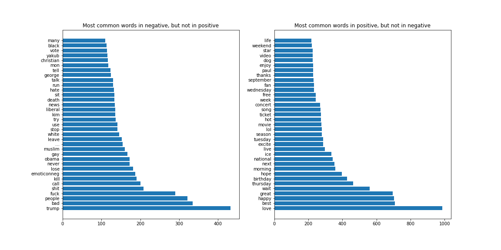

# Twitter Sentiment Evaluation - Comparison of Traditional Machine Learning Models and Neural Classifiers

This is an extension of my Natural Language Processing graduate project in which I compared the performance of a number of traditional machine learning classifiers trained on bag-of-words representations of the data with neural network classifiers using pre-trained GloVe word embeddings and pre-trained BERT transformer. It used the data from the Task 4 of [2017 Semeval Challenge](http://alt.qcri.org/semeval2017/task4/). 

## Bag-of-Words and Traditional Classifiers

### Summary of preprocessing

The following steps were undertaken to preprocess the raw data for training:
1. Lowercasing of all tokens.
2. Removal of URLs, numbers, hashtags and emojis. 
3. Recoding positive emoticons, negative emoticons and user mentions into three respective special tokens. This was warranted by the preliminary analysis of the training and development corpus, which seemed to suggest that these tokens provide some discriminatory power, as their proportions differed considerably in positive and negative tweets. This is summarized by the table below.
4. Tokenization.
5. Lemmatization using NLTK's WordNet lemmatizer, augmented by Part-of-Speech tagging using NLTK's 
pre-trained PoS tagger.
6. Stopword removal using NLTK's english stopwords corpus. Negation stopwords (such as not, no, etc.) were not removed, as they were expected to be useful in bigram representation of the data.

|                    |   negative |   neutral |   positive|
|:-------------------|-----------:|----------:|-----------:|
| urls               |      0.289 |     0.41  |      0.312 |
| emojis             |      0.025 |     0.015 |      0.039 |
| emoticons-positive |      0.03  |     0.041 |      0.088 |
| emoticons-negative |      0.022 |     0.005 |      0.003 |
| emoticons-neutral  |      0.001 |     0.001 |      0.001 |
| hashtags           |      0.364 |     0.433 |      0.384 |
| mentions           |      0.529 |     0.428 |      0.406 |
| numbers            |      0.49  |     0.753 |      0.672 |

Manual eveluation of most common tokens seems to suggest that there were no significant issues in the process. 

### Hyperparameter optimization and testing results

|       |   NaiveBayes-Count |   MaxEnt-Count |   SVC-Count |   KNN-Tfidf | |:------|-------------------:|---------------:|------------:|------------:|
| test1 |           0.571585 |       0.554163 |    0.630536 |    0.387227 |
| test2 |           0.568195 |       0.575681 |    0.622686 |    0.381052 |
| test3 |           0.554254 |       0.544365 |    0.590027 |    0.379937 |

The table above summarizes the macro-averaged F1 scores obtained from 4 machine learning classifiers (NaiveBayes, Maximum Entropy aka Logistic Regression, Support Vector Classifier using Linear Kernel and K Nearest Neighbours). Each of the models was trained on Bag-of-Words representation of the preprocessed training data using two text vectorization techniques - a simple count approach and Tfidf transformations. Each model's and vectorizer's hyperparameters were optimzied using a validation dataset with target class distribution that differed significantly from the training data. The vectorizers were optimized with respect to the the ngram range used and the minimum number of token occurences required to count a token, in order to limit the impact of the so-called "curse of dimensionality" while maintaining high informational content of the data. The most interesting result was that for 3 out of 4 models, Tfidf transformation of the count matrix decreased the valdiation performance. This might be explained by the fact that common words (e.g. "happy", "enjoy", "angry", "sad" etc.) were able to discriminate between sentiments better than those occuring less frequently in the corups, which are prioritized by Tfidf scoring. 

### Results - LSTM with GloVe Embeddings

Coming soon :)

